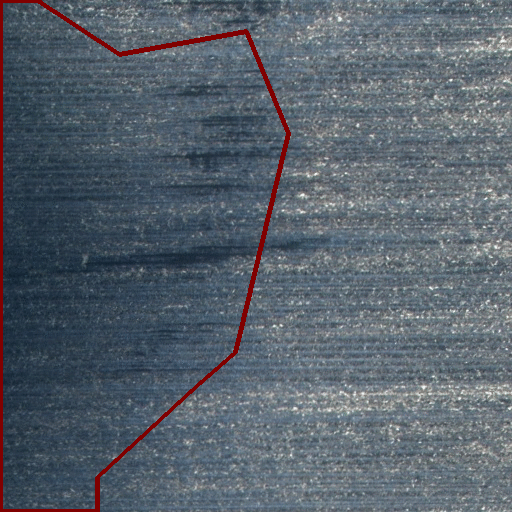
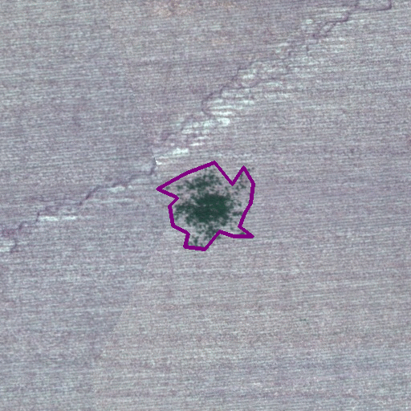

# Agriculture-Vision

Agriculture-Vision Dataset, Challenge and Workshop (CVPR 2020)

A joint effort with many great collaborators to bring Agriculture and Computer Vision / AI communities together to benefit humanity! 

## Update:
**The 2nd Agriculture-Vision Prize Challenge [has started](https://twitter.com/humphrey_shi/status/1382803774243287043?s=20) and new deadline is June 5, 2021. Total Prize: 20,000$.**

## Content

- [Papers](#papers)
- [Dataset](#dataset)
    * [Agriculture-Vision Challenge dataset](#agriculture-vision-challenge-dataset)
    * [Download](#download)
- [Evaluation](#evaluation)
    * [Evaluation Metric](#evaluation-metric)
    * [Submission](#submission)
- [Challenge](#challenge)
    * [Teams and Methods](#teams-and-methods)
    * [Challenge leaderboard](#challenge-leaderboard)
- [Workshop](#workshop)
    * [Schedule](#schedule)
    * [Paper Track](#paper-track)
    * [Accepted Papers](#accepted-papers)
    * [Accepted Posters](#accepted-posters)

## Papers:
CVPR paper on Agriculture-Vision <br/>
[ArXiv](https://arxiv.org/abs/2001.01306), [CVPR 2020 open access](https://openaccess.thecvf.com/content_CVPR_2020/html/Chiu_Agriculture-Vision_A_Large_Aerial_Image_Database_for_Agricultural_Pattern_Analysis_CVPR_2020_paper.html)
```BibTex
@article{chiu2020agriculture,
  title={Agriculture-Vision: A Large Aerial Image Database for Agricultural Pattern Analysis},
  author={Chiu, Mang Tik and Xu, Xingqian and Wei, Yunchao and Huang, Zilong and Schwing, Alexander and Brunner, Robert and Khachatrian, Hrant and Karapetyan, Hovnatan and Dozier, Ivan and Rose, Greg and others},
  journal={arXiv preprint arXiv:2001.01306},
  year={2020}
}

@InProceedings{Chiu_2020_CVPR,
author = {Chiu, Mang Tik and Xu, Xingqian and Wei, Yunchao and Huang, Zilong and Schwing, Alexander G. and Brunner, Robert and Khachatrian, Hrant and Karapetyan, Hovnatan and Dozier, Ivan and Rose, Greg and Wilson, David and Tudor, Adrian and Hovakimyan, Naira and Huang, Thomas S. and Shi, Honghui},
title = {Agriculture-Vision: A Large Aerial Image Database for Agricultural Pattern Analysis},
booktitle = {Proceedings of the IEEE/CVF Conference on Computer Vision and Pattern Recognition (CVPR)},
month = {June},
year = {2020}
}
```
CVPR Workshop paper on the 1st Agriculture-Vision Challenge (challenge dataset, methods and results) <br/>
[ArXiv](https://arxiv.org/abs/2004.09754), [CVPR 2020 open access](https://openaccess.thecvf.com/content_CVPRW_2020/html/w5/Chiu_The_1st_Agriculture-Vision_Challenge_Methods_and_Results_CVPRW_2020_paper.html)
```BibTex
@article{chiu20201st,
  title={The 1st Agriculture-Vision Challenge: Methods and Results},
  author={Chiu, Mang Tik and Xu, Xingqian and Wang, Kai and Hobbs, Jennifer and Hovakimyan, Naira and Huang, Thomas S. and Shi, Honghui and others},
  journal={arXiv preprint arXiv:2004.09754},
  year={2020}
}

@InProceedings{Chiu_2020_CVPR_Workshops,
author = {Chiu, Mang Tik and Xu, Xingqian and Wang, Kai and Hobbs, Jennifer and Hovakimyan, Naira and Huang, Thomas S. and Shi, Honghui},
title = {The 1st Agriculture-Vision Challenge: Methods and Results},
booktitle = {Proceedings of the IEEE/CVF Conference on Computer Vision and Pattern Recognition (CVPR) Workshops},
month = {June},
year = {2020}
}
```
## Dataset

### Agriculture-Vision Challenge Dataset

  
  

The dataset used in this challenge is a subset of the [Agriculture-Vision dataset](https://arxiv.org/abs/2001.01306). The challenge dataset contains 21,061 aerial farmland images captured throughout 2019 across the US. Each image consists of four 512x512 color channels, which are RGB and Near Infra-red (NIR). Each image also has a boundary map and a mask. The boundary map indicates the region of the farmland, and the mask indicates valid pixels in the image. Regions outside of either the boundary map or the mask are not evaluated.

This dataset contains six types of annotations: Cloud shadow, Double plant, Planter skip, Standing Water, Waterway and Weed cluster. These types of field anomalies have great impacts on the potential yield of farmlands, therefore it is extremely important to accurately locate them. In the Agriculture-Vision dataset, these six patterns are stored separately as binary masks due to potential overlaps between patterns. Users are free to decide how to use these annotations.

Each field image has a file name in the format of (**field id**)_(**x1**)-(**y1**)-(**x2**)-(**y2**).(**jpg**/**png**). Each field id uniquely identifies the farmland that the image is cropped from, and (x1, y1, x2, y2) is a 4-tuple indicating the position in which the image is cropped. Please refer to our paper for more details regarding how we construct the dataset.
### Download

The challenge dataset contains images, boundaries and masks for train, val and test set. It also contains labels for the train and val set only. The 2021 new dataset .tar.gz file is around 20 GB. Please [visit this page](https://www.agriculture-vision.com/agriculture-vision-2021/dataset-2021) to get access. By downloading or using the dataset, user signifies its agreement to [Agriculture-Vision Workshop Terms and Conditions](https://drive.google.com/file/d/1tiJpMjcr8mlF1pYU-6U6ZY5jnNgbn9XF/view?usp=sharing). 

## Evaluation

### Evaluation metric

We use mean Intersection-over-Union (mIoU) as our main quantitative evaluation metric, which is one of the most commonly used measures in semantic segmentation datasets. The mIoU is computed as:


Where **c** is the number of annotation types (**c** = 7 in our dataset, with 6 patterns + background), P<sub>c</sub> and T<sub>c</sub> are the predicted mask and ground truth mask of class c respectively.

Since our annotations may overlap, we modify the canonical mIoU metric to accommodate this property. For pixels with multiple labels, a prediction of either label will be counted as a correct pixel classification for that label, and a prediction that does not contain any ground truth labels will be counted as an incorrect classification for all ground truth labels.

Concretely, we construct the confusion matrix **M<sup>c×c</sup>** with the following rules:

For each prediction x and label set Y:

1. If **x** ∈ **Y**, then **M<sub>y,y</sub>** = **M<sub>y,y</sub>** + 1 for each **y** in **Y**<br/>
2. Otherwise, **M<sub>x,y</sub>** = **M<sub>x,y</sub>** + 1 for each **y** in **Y**<br/>

The mIoU is finally computed by (**true_positive**) / (**prediction** + **target** - **true_positive**), averaged across all classes.

### Submission

**Update:**

* The 1st Agriculture-Vision Prize Challenge has ended on April 20, 2020 (10:00 AM PDT). The final results as of the end date of the challenge can be found in these links ([png](https://github.com/SHI-Labs/Agriculture-Vision/raw/master/codalab_challenge_results.png), [csv](https://raw.githubusercontent.com/SHI-Labs/Agriculture-Vision/master/codalab_challenge_results.csv)).
* The Codalab evaluation server will remain open to encourage further research in Agriculture-Vision. No registration is required.

#### Registration
We are now hosting our evaluation/competition on **Codalab**. The competition page can be found [here](https://competitions.codalab.org/competitions/23732?secret_key=dba10d3a-a676-4c44-9acf-b45dc92c5fcf). Each participating team is required to register for the challenge. To register your team, fill out the registration form here, then register on the competition page.

*Make sure your Codalab account email matches one of the member emails in the registration form. Each team can only register once.

#### Codalab submission
All registered teams can evaluate their results on Codalab and publish their results on the leaderboard. The submission file should be a compressed **.zip** file that contains all prediction images. All prediction images should be in **png** format and the file names and image sizes should match the input images exactly. The prediction images will be converted to a 2D numpy array with the following code:

`numpy.array(PIL.Image.open(‘field-id_x1-y1-x2-y2.png’))`

In the loaded numpy array, only 0-6 integer labels are allowed, and they represent the annotations in the following way:

0 - **background**<br/>
1 - **cloud_shadow**<br/>
2 - **double_plant**<br/>
3 - **planter_skip**<br/>
4 - **standing_water**<br/>
5 - **waterway**<br/>
6 - **weed_cluster**<br/>

This label order will be strictly followed during evaluation.

All teams can have 2 submissions per day and 20 submissions in total.

## Challenge

We hosted the 1st Agriculture-Vision Prize Challenge with the following terms:

- <b>Model size will be limited below 150M parameters in total.</b>
- <b>The mIoU derived from the "results/" folder in the final submission should match the mIoU on the leaderboard.</b>
- <b>Predictions in "results/" in the final submission can be reproduced with the resources in "code/" and "models/".</b>
- <b>The training process of the method can be reproduced and the retrained model should have a similar performance.</b>
- <b>The test set is off-limits in training.</b>
- <b>For fairness, teams need to specify what public datasets are used for training/pre-training their models in their challenge_ report.pdf. Results that are generated from models using private datasets, and results without such details will be excluded from prize evaluation. (Results using private datasets can still be included in the report.)</b>
</b>
The prize award will be granted to the top 3 teams on the prize challenge leaderboard (closed on 4/20/2020) that provide a valid final submission.

### Teams and Methods

Please refer to our [workshop summary paper](https://arxiv.org/abs/2004.09754) for more details regarding notable methods.
Selected teams & methods:

**Team Hyunseong**: Hyunseong Park, Junhee Kim, Sungho Kim *(Agency for Defense Development, South Korea)*
- **Method**: Residual DenseNet with Expert Network for Semantic Segmentation

**Team SCG Vision**: Qinghui Liu, Michael C. Kampffmeyer, Robert Jenssen, Arnt B. Salberg *(Norwegian Computing Center, UiT The Arctic University of Norway)*
- **Method**: [Multi-view Self-Constructing Graph Convolutional Networks with Adaptive Class Weighting Loss for Semantic Segmentation](https://arxiv.org/abs/2004.10327)

**Team AGR**: Alexandre Barbosa, Rodrigo Trevisan *(University of Illinois at Urbana Champaign)*
- **Method**: Techniques for Improving Aerial Agricultural Image Semantic Segmentation

**Team TJU**: Bingchen Zhao, Shaozuo Yu, Siwei Yang, Yin Wang *(Tongji University)*
- **Method**: [Reducing the feature divergence of RGB and near-infrared images using Switchable Normalization](http://info.zhaobc.me/files/CVPRW_2020_AgriVis.pdf)

**Team Haossr**: Hao Sheng, Xiao Chen, Jingyi Su, Ram Rajagopal, Andrew Ng *(Stanford University, Chegg, Inc.)*
- **Method**: Effective Data Fusion with Generalized Vegetation Index: Evidence from Land Cover Segmentation in Agriculture

**Team CNUPR\_TH2L**: Van Thong Huynh, Soo-Hyung Kim, In-Seop Na *(Chonnam National University, Chosun University)*
- **Method**: Multi-spectra Attention in Aerial Agricultural Segmentation

**Team TeamTiger**: Ujjwal Baid, Shubham Innani, Prasad Dutande, Bhakti Baheti, Sanjay Talbar *(SGGS Institute of Engineering and Technology)*
- **Method**: Eff-PN: A Novel Deep Learning Approach for Anomaly Pattern Segmentation in Aerial Agricultural Images
### Challenge leaderboard

|Team|mIoU (%)|Background|Cloud shadow|Double plant|Planter skip|Standing water|Waterway|Weed cluster
|:-:|:-:|:-:|:-:|:-:|:-:|:-:|:-:|:-:|
|Hyunseong|63.9|80.6|56.0|57.9|57.5|75.0|63.7|56.9|
|seungjae|62.2|79.3|44.4|60.4|65.9|76.9|55.4|53.2|
|yjl912.2|61.5|80.1|53.7|46.1|48.6|76.8|71.5|53.6|
|ddcm|60.8|80.5|51.0|58.6|49.8|72.0|59.8|53.8|
|RodrigoTrevisan|60.5|80.2|43.8|57.5|51.6|75.3|66.2|49.2|
|SYDu|59.5|81.3|41.6|50.3|43.4|73.2|71.7|55.2|
|agri|59.2|78.2|55.8|42.9|42.0|77.5|64.7|53.2|
|Tennant|57.4|79.9|36.6|54.8|41.4|69.8|66.9|52.0|
|celery03.0|55.4|79.1|38.9|43.3|41.2|73.0|61.5|50.5|
|stevenwudi|55.0|77.4|42.0|54.4|20.1|69.5|67.7|53.8|
|PAII|55.0|79.9|38.6|47.6|26.2|74.6|62.1|55.7|
|agrichallenge1.2|54.6|80.9|50.9|39.3|29.2|73.4|57.8|50.5|
|hui|54.0|80.2|41.6|46.4|20.8|72.8|64.8|51.4|
|shenchen61.6|53.7|79.4|36.7|56.3|21.6|67.0|61.8|52.8|
|NTU|53.6|79.8|41.4|49.4|13.5|73.3|61.8|56.0|
|tpys|53.0|81.1|50.5|37.1|25.9|67.4|58.7|50.1|
|Simple|52.7|80.2|40.0|45.2|24.6|70.9|57.6|50.4|
|Ursus|52.3|78.9|36.3|37.8|34.4|69.3|57.1|52.3|
|liepieshov|52.1|77.2|40.2|46.0|16.0|71.3|62.9|51.1|
|Lunhao|49.4|79.5|40.4|38.8|10.5|69.4|58.3|49.1|
|tetelias-mipt|49.2|80.4|37.8|34.8|04.6|70.6|62.5|53.8|
|Dataloader|48.9|79.1|42.0|35.8|09.1|68.7|56.7|51.3|
|Hakjin|46.4|78.6|32.0|38.3|01.8|66.2|58.0|49.9|
|JianyuTANG|44.6|78.1|37.9|31.8|15.4|47.3|54.8|46.9|
|haossr|43.9|79.2|21.4|28.1|02.7|67.5|56.4|52.3|
|rpartsey|41.5|72.5|21.6|36.2|09.1|59.7|40.7|50.6|
|baidujjwal|40.8|75.2|26.1|40.1|09.9|48.0|37.1|49.5|
|Chaturlal|40.7|77.7|23.0|20.4|05.0|55.0|51.0|52.9|
|Sciforce|40.2|80.5|29.6|24.4|0.0|41.2|55.9|50.0|
|MustafaA|40.1|76.5|34.4|25.6|11.1|46.0|36.5|50.3|
|HaotianYan|36.8|77.1|21.9|25.1|13.7|57.5|24.3|37.9|
|gro|36.3|76.4|37.5|08.4|0.0|60.3|29.7|41.8|
|oscmansan|35.5|71.6|29.6|03.0|0.0|52.4|46.2|45.9|
|ThorstenC|33.6|72.3|22.3|10.0|02.0|40.8|40.1|47.8|
|ZHwang|33.5|76.5|32.4|12.9|0.0|57.2|15.9|39.9|
|fayzur2.0|22.1|65.4|21.8|02.2|00.2|23.3|13.4|28.7|
|gaslen.2|21.5|71.0|03.3|17.9|00.8|10.2|06.9|40.1|
|dvkhandelwal|16.3|71.5|0.0|0.0|0.0|42.6|0.0|0.0|
|ajeetsinghiitd|10.3|56.9|00.2|00.4|0.0|0.0|00.1|14.5|

## Workshop

### Schedule
***(Sunday, Jun 14 PDT)***
***
**08:30 – 08:40** [Opening Remarks and Welcome](http://cvpr20.com/events/w57-opening-remarks/)

Humphrey Shi (University of Oregon)

Naira Hovakimyan (UIUC)
***
**08:40 – 09:00** [Invited Talk 1: Scaling Spatio-Temporal Analytics: A Case in Agricultural Insights](http://cvpr20.com/event/w57-invited-talk-1/) (Talk video [here](https://www.youtube.com/watch?v=vHSflXlzmD4&list=PLPtQK8rJZ9HwYKOZoEH08mfUxxsijOGgU&index=2&t=0s))

Sharath Pankanti (IBM T.J. Watson Research Center)

**09:00 – 09:20** [Invited Talk 2: Multi-modality Remote Sensing in High Throughput Phenotyping: Opportunities for Machine Learning](http://cvpr20.com/event/w57-invited-talk-2/) (Talk video [here](https://www.youtube.com/watch?v=MuZzLO_doNI&list=PLPtQK8rJZ9HwYKOZoEH08mfUxxsijOGgU&index=3&t=0s))

Melba M. Crawford, Edward J. Delp (Purdue)

**09:20 – 09:40** [Invited Talk 3: Bridging Application and Research. Is agriculture just another application?](http://cvpr20.com/event/w57-invited-talk-3/) (Talk video [here](https://www.youtube.com/watch?v=vWY0esW-f4w&list=PLPtQK8rJZ9HwYKOZoEH08mfUxxsijOGgU&index=4&t=0s))

Jennifer Hobbs (IntelinAir Inc.)

**09:40 – 10:00** [Invited Talk 4: Improving Visual and Speech Recognition on Out-Domain Data](http://cvpr20.com/event/w57-invited-talk-4/) (Talk video [here](https://www.youtube.com/watch?v=2kovfm8Ye1o&list=PLPtQK8rJZ9HwYKOZoEH08mfUxxsijOGgU&index=5&t=0s))

Liangliang Cao (Google Inc. and Umass)

**10:00 – 10:20** [Invited Talk 5: Learning to Anticipate](http://cvpr20.com/event/w57-invited-talk-5/) (Talk video [here](https://www.youtube.com/watch?v=WRlDO8PQj1E&list=PLPtQK8rJZ9HwYKOZoEH08mfUxxsijOGgU&index=6&t=8s))

Alex Schwing (UIUC)
***
**10:20 – 11:10** [Poster Session 1](http://cvpr20.com/w57-poster-session-1/)
***
**11:10 – 11:20** [Oral 1: MSCG-Net with Adaptive Class Weighting Loss for Semantic Segmentation](http://cvpr20.com/w57-oral-presentation-1/) (Talk video [here](https://youtu.be/RpLN_KnEYYo))<br/>
**11:20 – 11:30** [Oral 2: Finding Berries: Segmentation and Counting of Cranberries using Point Supervision and Shape Priors](http://cvpr20.com/w57-oral-presentation-2/) (Talk video [here](https://youtu.be/VZWVBDbRVvk))<br/>
**11:30 – 11:40** [Oral 3: Visual 3D Reconstruction and Dynamic Simulation of Fruit Trees for Robotic Manipulation](http://cvpr20.com/w57-oral-presentation-3/) (Talk video [here](https://youtu.be/lllcolF_VSw))<br/>
**11:40 – 11:50** [Oral 4: Cross-Regional Oil Palm Tree Detection](http://cvpr20.com/w57-oral-presentation-4/) (Talk video [here](https://youtu.be/UDCFZnuRA14))<br/>
**11:50 – 11:00** [Oral 5: Effective Data Fusion with Generalized Vegetation Index](http://cvpr20.com/w57-oral-presentation-5/) (Talk video [here](https://youtu.be/8pDWvr3qOVI))<br/>
**11:00 – 12:10** [Oral 6: Weakly Supervised Learning Guided by Activation Mapping Applied to a Novel Citrus Pest Benchmark](http://cvpr20.com/w57-oral-presentation-6/) (Talk video [here](https://youtu.be/hAQpOHzLZDo))<br/>
**12:10 – 12:20** [Oral 7: Fine-Grained Recognition in High-throughput Phenotyping](http://cvpr20.com/w57-oral-presentation-7/) (Talk video [here](https://youtu.be/HbhRFrMwZWw))<br/>
**12:20 – 12:30** [Oral 8: Climate Adaptation: Reliably Predicting from Imbalanced Satellite Data](http://cvpr20.com/w57-oral-presentation-8/) (Talk video [here](https://youtu.be/47Rcdg0gEJk))<br/>
***
**12:30 – 13:30** [Lunch Break](http://cvpr20.com/events/w57-opening-remarks/)
***
**13:30 – 13:50** [Invited Talk 6: Towards Understanding Agricultural Systems at Scale using Machine Learning](http://cvpr20.com/event/w57-invited-talk-6/) (Talk video [here](https://www.youtube.com/watch?v=EptOqwBiTMI&list=PLPtQK8rJZ9HwYKOZoEH08mfUxxsijOGgU&index=7&t=0s))

Stefano Ermon (Stanford)

**13:50 – 14:10** [Invited Talk 7: Interactive Object Segmentation (Live*)](http://cvpr20.com/events/w57-opening-remarks/) (Talk video [here](https://www.youtube.com/watch?v=IwfcbL-YadM&list=PLPtQK8rJZ9HwYKOZoEH08mfUxxsijOGgU&index=8&t=2s))

Yunchao Wei (University of Technology Sydney)

**14:10 – 14:30** [Invited Talk 8: Project FarmBeats: Aerial Mapping forAgricultural Farms and Beyond (Live*)](http://cvpr20.com/events/w57-opening-remarks/) (Talk video [here](https://youtu.be/_7XGX2YDR5Q))

Ranveer Chandra, Sudipta Sinha (Microsoft)

**14:30 – 14:50** [Invited Talk 9: Enabling the African Farmer (Live*)](http://cvpr20.com/events/w57-opening-remarks/) (Talk video [here](https://www.youtube.com/watch?v=XJH_lRHK4bk&list=PLPtQK8rJZ9HwYKOZoEH08mfUxxsijOGgU&index=10&t=0s))

Munther Dahleh (MIT)

**14:50 – 15:10** [Invited Talk 10: (Live*)](http://cvpr20.com/events/w57-opening-remarks/)

Zsolt Kira (Georgia Tech)
***
**15:10 – 15:55** [Poster Session 2](http://cvpr20.com/w57-poster-session-2/)
***
**15:55 – 16:10** [Agriculture-Vision Prize Challenge Results Summary](http://cvpr20.com/event/w57-challenge-summary/) (Talk video [here](https://drive.google.com/drive/folders/1LBz15UT58R-a-RcFlAR0BSu2mLujUSqE?usp=sharing))

**16:10 – 16:20** [Challenge Presentation 1: Residual DenseNet with Expert Network for Semantic Segmentation](http://cvpr20.com/event/w57-challenge-presentation-1/)

**16:20 – 16:30** [Challenge Presentation 2: MSCG-Net Models for The 1st Agriculture-Vision Challenge](http://cvpr20.com/event/w57-challenge-presentation-2/)
***
**16:30 – 17:20** [Panel Discussion: Challenge & Opportunities for Computer Vision in Agriculture](http://cvpr20.com/event/w57-panel-discussion/) (video [here](https://youtu.be/3afvCMW92VA))

**Host:**<br/>
Naira Hovakimyan (UIUC)

**Panelists:**<br/>
Sharath Pankanti (IBM T. J. Watson Research Center)

Liangliang Cao (Google Research)

Ranveer Chandra (Microsoft Azure Global)

Sudipta Sinha (Microsoft)

Munther Dahleh (MIT)

Ed Delp (Purdue)

Melba Crawford (Purdue)

Jennifer Hobbs (Intelinair Inc.)

Yunchao Wei (University of Technology Sydney)

Alexander Schwing (UIUC)

Zsolt Kira (Georgia Tech)

David Wilson (Intelinair Inc.)

Jim Yuan (Google X)

Humphrey Shi (U of Oregon)
***
**17:20 – 17:30** [Closing Remarks](http://cvpr20.com/event/w57-closing-remarks/)

Humphrey Shi (University of Oregon)

Naira Hovakimyan (UIUC)
***
### Paper Track

- We accept papers related to Agriculture-Vision with a rigorous peer-review process with program committee members from  multiple research communities including computer vision, machine learning, image processing, remote sensing, agriculture etc.
- All accepted paper will be published in IEEE CVPR 2020 Workshop Proceedings. 
- Several top accepted papers will be given oral presentation opportunity at our workshop, the rest accepted papers will be given poster presentation slots during the workshop.

#### Topic Description

The Workshop will be open to the broader community addressing **various technical and application aspects of challenges and opportunities in computer vision research for agriculture.** We aim to provide a venue to both show current relevant efforts in interdisciplinary areas between computer vision and agriculture, and to encourage further research and conversations within the computer vision community to tackle impactful agriculture-vision problems. We will solicit papers from the following wide range of topics:

- Computer vision research for agricultural imagery in general
- Resources and benchmarks for agricultural imagery based pattern analysis
- Farmland pattern classification and segmentation from LSHR aerial imagery
- Efficient data sampling methods for effective training on agricultural imageries
- Effective data fusion of multi-spectral image data such as RGB and Near-Infrared (RGB-NIR)
- Robust and stable pattern recognition on sparse and imbalanced annotations
- Other novel vision applications in agriculture

### Accepted Papers

- **[Multi-view Self-Constructing Graph Convolutional Networks with Adaptive Class Weighting Loss for Semantic Segmentation](https://arxiv.org/abs/2004.10327) (Oral)**,<br/>
    Qinghui Liu, Michael C. Kampffmeyer, Robert Jenssen, Arnt B. Salberg *(Norwegian Computing Center, UiT The Arctic University of Norway)*

- **[Reducing the feature divergence of RGB and near-infrared images using Switchable Normalization](http://info.zhaobc.me/files/CVPRW_2020_AgriVis.pdf) (Poster)**,<br/>
    Siwei Yang\*, Shaozuo Yu\*, Bingchen Zhao\*, Yin Wang (\* equal contribution)*(Tongji University)*

- **[Finding Berries: Segmentation and Counting of Cranberries using Point Supervision and Shape Priors](https://arxiv.org/abs/2004.08501) (Oral)**,<br/>
    Peri Akiva, Kristin Dana, Peter Oudemans, Michael Mars *(Rutgers University)*

- **Leaf Spot Attention Network for Apple Leaf Disease Identification (Poster)**,<br/>
    Hee-Jin Yu, Chang-Hwan Son *(Kunsan National University)*

- **Visual 3D Reconstruction and Dynamic Simulation of Fruit Trees for Robotic Manipulation (Oral)**,<br/> 
    Francisco J Yandun, Abhisesh Silwal; George Kantor *(Carnegie Mellon University)*

- **Cross-Regional Oil Palm Tree Detection (Oral)**,<br/>
    Wenzhao Wu, Juepeng Zheng, Haohuan Fu, Weijia Li, Le Yu *(Tsinghua University, The Chinese University of Hong Kong)*

- **Multi-Stream CNN for Spatial Resource Allocation: a Crop Management Application (Poster)**,<br/>
    Alexandre Barbosa, Thiago Marinho, Nicolas Martin, Naira Hovakimyan *(University of Illinois at Urbana-Champaign)*

- **Effective Data Fusion with Generalized Vegetation Index: Evidence from Land Cover Segmentation in Agriculture (Oral)**,<br/> 
    Hao Sheng, Xiao Chen, Jingyi Su, Ram Rajagopal, Andrew Ng *(Stanford University)*

- **Deep Transfer Learning For Plant Center Localization (Poster)**,<br/>
    Enyu Cai, Sriram Baireddy, Changye Yang, Melba Crawford, Edward Delp *(Purdue University)*

- **Segmentation and detection from organised 3D point clouds: a case study in broccoli head detection (Poster)**,<br/>
    Justin Le Louëdec, Hector A. Montes, Tom Duckett, Grzegorz Cielniak *(University of Lincoln)*

- **Deep Learning based Corn Kernel Classification (Poster)**,<br/>
    Henry Velesaca, Raúl Mira, Patricia L Suarez,  Christian Larrea, Angel Sappa *(ESPOL, Computer Vision Center, Spain)*

- **Improving In-field Cassava Whitefly Pest Surveillance with Machine Learning (Poster)**,<br/>
    Jeremy Tusubira, Solomon nsumba, Flavia Ninsiima, Benjamin Akera, Guy Acellam, Joyce Nakatumba-Nabende, Ernest Mwebaze, John A Quinn, Tonny Oyana *(Makerere University, Google)*

- **[Weakly Supervised Learning Guided by Activation Mapping Applied to a Novel Citrus Pest Benchmark](https://arxiv.org/abs/2004.11252) (Oral)**,<br/>
    Edson Riberto Bollis, Helio Pedrini, Sandra Avila *(UNICAMP)*

- **Fine-Grained Recognition in High-throughput Phenotyping (Oral)**,<br/>
    Beichen Lyu, Stuart Smith, Keith Cherkauer *(Purdue University)*

- **[A Novel Technique Combining Image Processing, Plant Development Properties, and the Hungarian Algorithm, to Improve Leaf Detection in Maize](https://arxiv.org/abs/2005.09022) (Poster)**,<br/>
    Nazifa Khan, Ian McQuillan, Mark Eramian, Oliver A.S. Lyon *(University of Saskatchewan, Queen's University)*

- **[Farm Parcel Delineation Using Spatio-temporal Convolutional Networks](https://arxiv.org/abs/2004.05471) (Poster)**,<br/>
    Han Lin Aung, Burak Uzkent, Marshall Burke, David Lobell, Stefano Ermon *(Stanford University)*

- **[Climate Adaptation: Reliably Predicting from Imbalanced Satellite Data](https://arxiv.org/abs/2004.12344) (Oral)**,<br/>
    Ruchit Rawal, Prabhu Pradhan *(NSIT, Max Planck Institute for Intelligent Systems)*

### Accepted Posters

- **Scoring Root Necrosis in Cassava Using Semantic Segmentation**,<br/>
    Joyce Nakatumba-Nabende, Jeremy Tusubira, Benjamin Akera, Ernest Mwebaze *(Makerere University, Google)*

- **Active Learning Sampling Strategies For Weed Segmentation**,<br/>
    Andrei Polzounov, Anshul Tibrewal, Ben Cline, Olgert Denas, Chris Padwick, Jim Ostrowski *(Blue River Technology)*

- **[Convolutional Neural Networks for Image-based Corn Kernel Detection and Counting](https://arxiv.org/abs/2003.12025)**,<br/>
    Saeed Khaki, Hieu Pham, Ye Han, Andy Kuhl, Wade Kent, Lizhi Wang *(Iowa State University, Syngenta)*

- **Eff-PN: A Novel Deep Learning Approach for Anomaly Pattern Segmentation in Aerial Agricultural Images**,<br/>
    Shubham Innani, Prasad Dutande, Ujjwal R Baid, Bhakti Vilas Baheti, Sanjay Talbar *(SGGSIET Nanded)*

- **Deep Unsupervised Deblurring Approach for Improving Crops Disease Classification**,<br/>
    Javed Ahmad, Fahad Shamshad, Junaid Maqbool, Ali Ahmed *(Information Technology University)*

- **NDVI Vegetation Index Estimation Through an\\ Unsupervised Deep Learning based Approach**,<br/>
    Patricia L Suarez, Angel Sappa, Boris Vintimilla *(ESPOL POLYTECHNIC UNIVERSITY)*

- **Plants Disease Detection in Low Data Regime**,<br/>
    Shruti Jadon *(Brown University (Rhode Island Hospital))*

- **Semi-Supervised Crop Detection in UAV Orthophotographs**,<br/>
    Jana Wieme, Sam Leroux, Simon Cool, Ruben Van De Vijver, Wouter H. Maes, Jan Pieters *(Ghent University)*

- **Counting Corn Stands using Drone Images from Cloud to Edge –A Deep Learning-based Object Detection Approach**,<br/>
    Zhiyi Li, Kshitiz Dhakal, Song Li *(Virginia Tech)*
